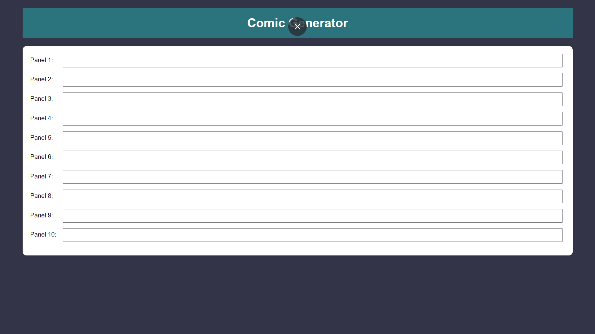
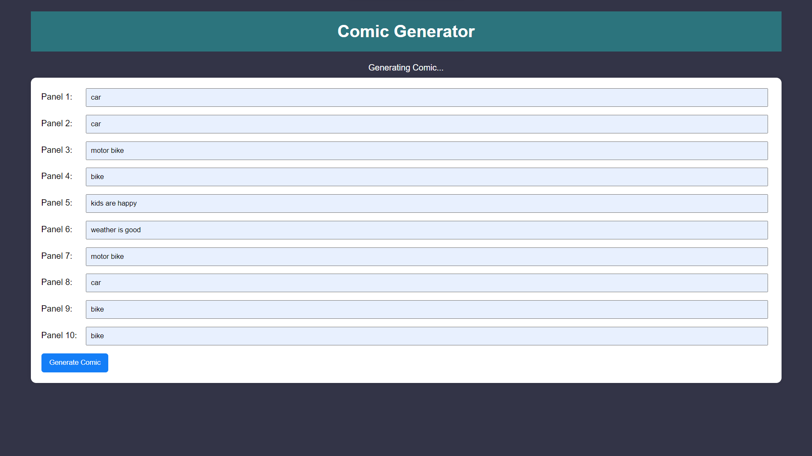
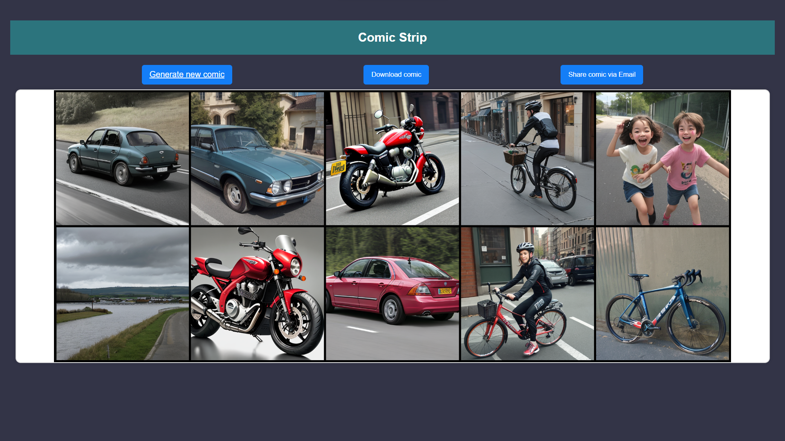
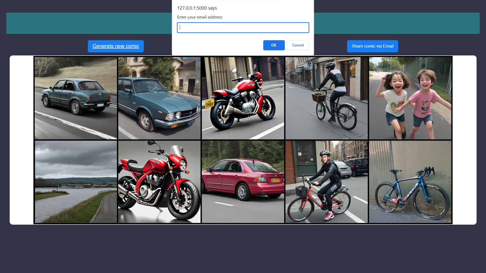
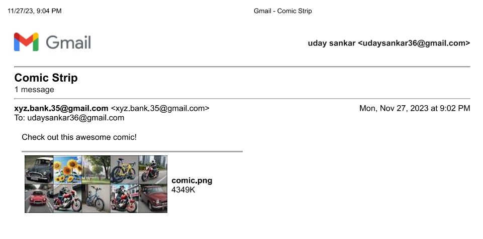

# comic

Configuration in app.py:
1) This is avail comic sharing over mail. 
2) Update email (smtp_username) and device specific password (smtp_password) for the corresponding mail in the send_email function of app.py.

Steps to Genearte comic:
1) Run the app.py file.

2) Enter text in all the 10 panels. After that you can view generate comic button and click on it.

3) It will take some time to generate the image.

4) Once the back-end process is completed image will be displayed on the webpage. 
5) This page also have options generate new comic, download generated comic, and share the comic over mail.

6) To share comic over mail, make sure you have configured app.py with mail and device specific password for the corresponding mail. 
